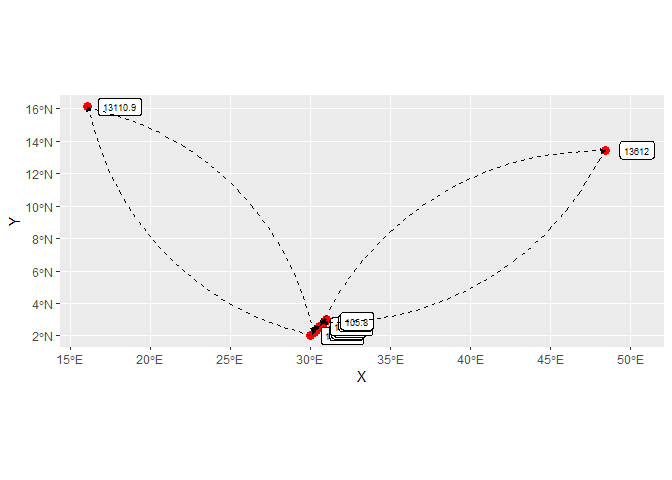
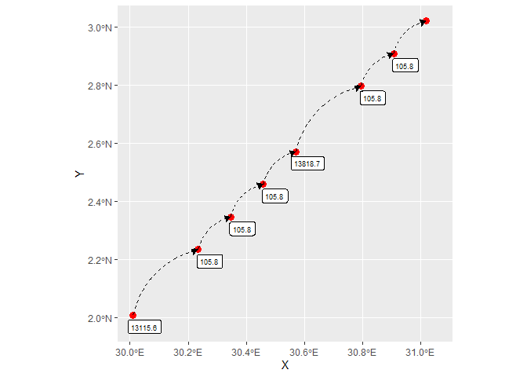

# Function `remove_outliers()`: detect and remove outliers based on speed

This is a function developed to identify and remove outliers from GPS
data using speed as the detecting metric. Speed is a good metric for
outlier detection as it expresses distance covered given elapsed time,
therefore highlighting instances of erroneous movement caused by sensor
malfunctions. Here we have a close look at the function developed to
perform this task.

Let’s peak at the function’s code.

``` r
remove_outliers
```

    function (data, kmph_tresh) 
    {
        if (!mt_is_move2(data)) 
            stop("`data` must be a move2 object")
        if (!mt_is_time_ordered(data)) 
            stop("`data` must ordered by time")
        n_start <- nrow(data)
        kmph <- as.vector(set_units(mt_speed(data), "km/h"))
        i <- 1
        cli::cli_progress_bar("Sweeping")
        while (any(kmph > kmph_tresh, na.rm = TRUE)) {
            fastindex <- which(kmph > kmph_tresh)[1] + 1
            data <- data[-fastindex, ]
            kmph <- as.vector(set_units(mt_speed(data), "km/h"))
            i <- i + 1
            if (i == 1e+06) {
                warning("Jumping out of while loop as condition not being met within reasonable number of iterations")
                break
            }
            cli::cli_progress_update()
        }
        n_end <- nrow(data)
        n_rows_dropped <- n_start - n_end
        if (n_rows_dropped > 0) {
            logger.info(paste0("Found ", n_rows_dropped, " locations associated with speeds greater than the threshold of ", 
                kmph_tresh, "kmph. Transgressing locations were removed"))
        }
        else {
            logger.info("No outliers detected")
        }
        return(data)
    }

Generate mock base data.

``` r
n <- 10
dt <- data.frame(
  x = seq(30.01, 31.02, length.out = n), 
  y = seq(2.01, 3.02, length.out = n),
  time = seq.POSIXt(
    as.POSIXct("2023-01-01 00:00:00 UTC"),
    as.POSIXct("2023-01-01 01:30:00 UTC"), 
    length.out = n
  ), 
  track = "a"
)

dt_mv2_base <- mt_as_move2(
  dt,
  coords = c("x", "y"), 
  time_column = "time",
  track_id_column = "track") |> 
  sf::st_set_crs(4326L)

dt_mv2_base
```

    A <move2> object containing 1 track consisting of:
    Simple feature collection with 10 features and 2 fields
    Geometry type: POINT
    Dimension:     XY
    Bounding box:  xmin: 30.01 ymin: 2.01 xmax: 31.02 ymax: 3.02
    Geodetic CRS:  WGS 84
                      time track                  geometry
    1  2023-01-01 00:00:00     a        POINT (30.01 2.01)
    2  2023-01-01 00:10:00     a POINT (30.12222 2.122222)
    3  2023-01-01 00:20:00     a POINT (30.23444 2.234444)
    4  2023-01-01 00:30:00     a POINT (30.34667 2.346667)
    5  2023-01-01 00:40:00     a POINT (30.45889 2.458889)
    6  2023-01-01 00:50:00     a POINT (30.57111 2.571111)
    7  2023-01-01 01:00:00     a POINT (30.68333 2.683333)
    8  2023-01-01 01:10:00     a POINT (30.79556 2.795556)
    9  2023-01-01 01:20:00     a POINT (30.90778 2.907778)
    10 2023-01-01 01:30:00     a        POINT (31.02 3.02)
    Track features:
      track
    1     a

## Application to two consecutive outliers

Add two outliers to the 2nd and 3rd positions and ad speeds (km/h).

``` r
dt_mv2 <- dt_mv2_base
st_geometry(dt_mv2)[c(2, 3)] <- st_sfc(st_point(c(12.11, 13.12)), st_point(c(12.4, 13.45)))
dt_mv2$kmph <- mt_speed(dt_mv2) |> set_units("km/h") |> as.vector()
dt_mv2
```

    A <move2> object containing 1 track consisting of:
    Simple feature collection with 10 features and 3 fields
    Geometry type: POINT
    Dimension:     XY
    Bounding box:  xmin: 12.11 ymin: 2.01 xmax: 31.02 ymax: 13.45
    Geodetic CRS:  WGS 84
                      time track                  geometry       kmph
    1  2023-01-01 00:00:00     a        POINT (30.01 2.01) 13950.1303
    2  2023-01-01 00:10:00     a       POINT (12.11 13.12)   289.7079
    3  2023-01-01 00:20:00     a        POINT (12.4 13.45) 13965.8260
    4  2023-01-01 00:30:00     a POINT (30.34667 2.346667)   105.8376
    5  2023-01-01 00:40:00     a POINT (30.45889 2.458889)   105.8331
    6  2023-01-01 00:50:00     a POINT (30.57111 2.571111)   105.8285
    7  2023-01-01 01:00:00     a POINT (30.68333 2.683333)   105.8236
    8  2023-01-01 01:10:00     a POINT (30.79556 2.795556)   105.8186
    9  2023-01-01 01:20:00     a POINT (30.90778 2.907778)   105.8133
    10 2023-01-01 01:30:00     a        POINT (31.02 3.02)         NA
    Track features:
      track
    1     a

Plot locations and movement

``` r
ggplot(dt_mv2) +
  geom_sf(col = "red", size = 3) +
  geom_sf_label(aes(label = round(kmph, 1)), nudge_x = 0.8, size = 2.5) +
  geom_curve(
    aes(x = X, y = Y, xend = lead(X), yend = lead(Y)), 
    data = as_tibble(st_coordinates(dt_mv2)),
    curvature = -0.3,
    arrow = arrow(length = unit(0.02, "npc"), type = "closed"),
    linetype = "dashed"
  )
```

    Warning in st_point_on_surface.sfc(sf::st_zm(x)): st_point_on_surface may not
    give correct results for longitude/latitude data

    Warning: Removed 1 rows containing missing values (`geom_label()`).

    Warning: Removed 1 rows containing missing values (`geom_curve()`).


Remove outliers.

``` r
dt_mv2_clean <- dt_mv2 |> 
  remove_outliers(kmph_tresh = 150)
```

    [INFO] Found 2 locations associated with speeds greater than the threshold of 150kmph. Transgressing locations were removed

``` r
dt_mv2_clean <- dt_mv2_clean |> 
  mutate(kmph = mt_speed(dt_mv2_clean) |> set_units("km/h") |> as.vector())

dt_mv2_clean
```

    A <move2> object containing 1 track consisting of:
    Simple feature collection with 8 features and 3 fields
    Geometry type: POINT
    Dimension:     XY
    Bounding box:  xmin: 30.01 ymin: 2.01 xmax: 31.02 ymax: 3.02
    Geodetic CRS:  WGS 84
                      time track                  geometry     kmph
    1  2023-01-01 00:00:00     a        POINT (30.01 2.01) 105.8458
    4  2023-01-01 00:30:00     a POINT (30.34667 2.346667) 105.8376
    5  2023-01-01 00:40:00     a POINT (30.45889 2.458889) 105.8331
    6  2023-01-01 00:50:00     a POINT (30.57111 2.571111) 105.8285
    7  2023-01-01 01:00:00     a POINT (30.68333 2.683333) 105.8236
    8  2023-01-01 01:10:00     a POINT (30.79556 2.795556) 105.8186
    9  2023-01-01 01:20:00     a POINT (30.90778 2.907778) 105.8133
    10 2023-01-01 01:30:00     a        POINT (31.02 3.02)       NA
    Track features:
      track
    1     a

Plot resultant data

``` r
ggplot(dt_mv2_clean) +
  geom_sf(col = "red", size = 3) +
  geom_sf_label(aes(label = round(kmph, 1)), nudge_x = 0.04, nudge_y = -0.04, size = 2.5) +
  geom_curve(
    aes(x = X, y = Y, xend = lead(X), yend = lead(Y)), 
    data = as_tibble(st_coordinates(dt_mv2_clean)),
    curvature = -0.3,
    arrow = arrow(length = unit(0.02, "npc"), type = "closed"),
    linetype = "dashed"
  )
```

    Warning in st_point_on_surface.sfc(sf::st_zm(x)): st_point_on_surface may not
    give correct results for longitude/latitude data

    Warning: Removed 1 rows containing missing values (`geom_label()`).

    Warning: Removed 1 rows containing missing values (`geom_curve()`).


## Application to outliers in non-consecutive locations

``` r
dt_mv2_sep <- dt_mv2_base
st_geometry(dt_mv2_sep)[c(2, 7)] <- st_sfc(st_point(c(16.11, 16.12)), st_point(c(48.4, 13.45)))
dt_mv2_sep$kmph <- mt_speed(dt_mv2_sep) |> set_units("km/h") |> as.vector()
dt_mv2_sep
```

    A <move2> object containing 1 track consisting of:
    Simple feature collection with 10 features and 3 fields
    Geometry type: POINT
    Dimension:     XY
    Bounding box:  xmin: 16.11 ymin: 2.01 xmax: 48.4 ymax: 16.12
    Geodetic CRS:  WGS 84
                      time track                  geometry       kmph
    1  2023-01-01 00:00:00     a        POINT (30.01 2.01) 13115.5537
    2  2023-01-01 00:10:00     a       POINT (16.11 16.12) 13110.8819
    3  2023-01-01 00:20:00     a POINT (30.23444 2.234444)   105.8418
    4  2023-01-01 00:30:00     a POINT (30.34667 2.346667)   105.8376
    5  2023-01-01 00:40:00     a POINT (30.45889 2.458889)   105.8331
    6  2023-01-01 00:50:00     a POINT (30.57111 2.571111) 13818.6901
    7  2023-01-01 01:00:00     a        POINT (48.4 13.45) 13612.0343
    8  2023-01-01 01:10:00     a POINT (30.79556 2.795556)   105.8186
    9  2023-01-01 01:20:00     a POINT (30.90778 2.907778)   105.8133
    10 2023-01-01 01:30:00     a        POINT (31.02 3.02)         NA
    Track features:
      track
    1     a

Plot locations and movement

``` r
ggplot(dt_mv2_sep) +
  geom_sf(col = "red", size = 3) +
  geom_sf_label(aes(label = round(kmph, 1)), nudge_x = 2, size = 2.5) +
  geom_curve(
    aes(x = X, y = Y, xend = lead(X), yend = lead(Y)), 
    data = as_tibble(st_coordinates(dt_mv2_sep)),
    curvature = -0.3,
    arrow = arrow(length = unit(0.02, "npc"), type = "closed"),
    linetype = "dashed"
  )
```

    Warning in st_point_on_surface.sfc(sf::st_zm(x)): st_point_on_surface may not
    give correct results for longitude/latitude data

    Warning: Removed 1 rows containing missing values (`geom_label()`).

    Warning: Removed 1 rows containing missing values (`geom_curve()`).



Remove outliers & plot resultant data

``` r
dt_mv2_sep_clean <- dt_mv2_sep |> 
  remove_outliers(kmph_tresh = 150)
```

    [INFO] Found 2 locations associated with speeds greater than the threshold of 150kmph. Transgressing locations were removed

``` r
dt_mv2_sep_clean |> 
  mutate(kmph = mt_speed(dt_mv2_sep_clean) |> set_units("km/h") |> as.vector())
```

    A <move2> object containing 1 track consisting of:
    Simple feature collection with 8 features and 3 fields
    Geometry type: POINT
    Dimension:     XY
    Bounding box:  xmin: 30.01 ymin: 2.01 xmax: 31.02 ymax: 3.02
    Geodetic CRS:  WGS 84
                      time track                  geometry     kmph
    1  2023-01-01 00:00:00     a        POINT (30.01 2.01) 105.8478
    3  2023-01-01 00:20:00     a POINT (30.23444 2.234444) 105.8418
    4  2023-01-01 00:30:00     a POINT (30.34667 2.346667) 105.8376
    5  2023-01-01 00:40:00     a POINT (30.45889 2.458889) 105.8331
    6  2023-01-01 00:50:00     a POINT (30.57111 2.571111) 105.8260
    8  2023-01-01 01:10:00     a POINT (30.79556 2.795556) 105.8186
    9  2023-01-01 01:20:00     a POINT (30.90778 2.907778) 105.8133
    10 2023-01-01 01:30:00     a        POINT (31.02 3.02)       NA
    Track features:
      track
    1     a

``` r
ggplot(dt_mv2_sep_clean) +
  geom_sf(col = "red", size = 3) +
  geom_sf_label(aes(label = round(kmph, 1)), nudge_x = 0.04, nudge_y = -0.04, size = 2.5) +
  geom_curve(
    aes(x = X, y = Y, xend = lead(X), yend = lead(Y)), 
    data = as_tibble(st_coordinates(dt_mv2_sep_clean)),
    curvature = -0.3,
    arrow = arrow(length = unit(0.02, "npc"), type = "closed"),
    linetype = "dashed"
  )
```

    Warning in st_point_on_surface.sfc(sf::st_zm(x)): st_point_on_surface may not
    give correct results for longitude/latitude data

    Warning: Removed 1 rows containing missing values (`geom_label()`).

    Warning: Removed 1 rows containing missing values (`geom_curve()`).



## Show that it also works for more than one animal

``` r
n <- 10
dt_2 <- data.frame(
  x = seq(30.01, 31.02, length.out = n), 
  y = seq(2.01, 3.02, length.out = n),
  time = seq.POSIXt(
    as.POSIXct("2023-01-01 00:00:00 UTC"),
    as.POSIXct("2023-01-01 01:30:00 UTC"), 
    length.out = n
  ), 
  track = c(rep("a", floor(n/2)), rep("b", ceiling(n/2)))
) |> 
  mutate(
    x = ifelse(track == "b", x + 2, x),
    y = ifelse(track == "b", y - 3, y)
  )

dt_2_mv2 <- mt_as_move2(
  dt_2,
  coords = c("x", "y"), 
  time_column = "time",
  track_id_column = "track") |> 
  sf::st_set_crs(4326L)

dt_2_mv2
```

    A <move2> object containing 2 tracks consisting of:
    Simple feature collection with 10 features and 2 fields
    Geometry type: POINT
    Dimension:     XY
    Bounding box:  xmin: 30.01 ymin: -0.4288889 xmax: 33.02 ymax: 2.458889
    Geodetic CRS:  WGS 84
                      time track                     geometry
    1  2023-01-01 00:00:00     a           POINT (30.01 2.01)
    2  2023-01-01 00:10:00     a    POINT (30.12222 2.122222)
    3  2023-01-01 00:20:00     a    POINT (30.23444 2.234444)
    4  2023-01-01 00:30:00     a    POINT (30.34667 2.346667)
    5  2023-01-01 00:40:00     a    POINT (30.45889 2.458889)
    6  2023-01-01 00:50:00     b  POINT (32.57111 -0.4288889)
    7  2023-01-01 01:00:00     b  POINT (32.68333 -0.3166667)
    8  2023-01-01 01:10:00     b  POINT (32.79556 -0.2044444)
    9  2023-01-01 01:20:00     b POINT (32.90778 -0.09222222)
    10 2023-01-01 01:30:00     b           POINT (33.02 0.02)
    Track features:
      track
    1     a
    2     b

``` r
st_geometry(dt_2_mv2)[c(2, 8)] <- st_sfc(st_point(c(12.11, 13.12)), st_point(c(20.4, -2)))
dt_2_mv2$kmph <- mt_speed(dt_2_mv2) |> set_units("km/h") |> as.vector()
dt_2_mv2
```

    A <move2> object containing 2 tracks consisting of:
    Simple feature collection with 10 features and 3 fields
    Geometry type: POINT
    Dimension:     XY
    Bounding box:  xmin: 12.11 ymin: -2 xmax: 33.02 ymax: 13.12
    Geodetic CRS:  WGS 84
                      time track                     geometry       kmph
    1  2023-01-01 00:00:00     a           POINT (30.01 2.01) 13950.1303
    2  2023-01-01 00:10:00     a          POINT (12.11 13.12) 13995.5427
    3  2023-01-01 00:20:00     a    POINT (30.23444 2.234444)   105.8418
    4  2023-01-01 00:30:00     a    POINT (30.34667 2.346667)   105.8376
    5  2023-01-01 00:40:00     a    POINT (30.45889 2.458889)         NA
    6  2023-01-01 00:50:00     b  POINT (32.57111 -0.4288889)   105.8830
    7  2023-01-01 01:00:00     b  POINT (32.68333 -0.3166667)  8269.7169
    8  2023-01-01 01:10:00     b              POINT (20.4 -2)  8439.5708
    9  2023-01-01 01:20:00     b POINT (32.90778 -0.09222222)   105.8841
    10 2023-01-01 01:30:00     b           POINT (33.02 0.02)         NA
    Track features:
      track
    1     a
    2     b

Plot locations and movements

``` r
endpoints <- as_tibble(st_coordinates(dt_2_mv2)) |> 
  mutate(track = dt_2_mv2$track) |> 
  mutate(x_end = lead(X), y_end = lead(Y), .by = track)

dt_2_mv2 |> 
  ggplot(aes(group = track, col = track)) +
  geom_sf(size = 2) +
  geom_sf_label(aes(label = round(kmph, 1)), nudge_x = 2, size = 2.5) +
  geom_curve(
    aes(x = X, y = Y, xend = x_end, yend = y_end, group = track), 
    data = endpoints,
    curvature = -0.2,
    arrow = arrow(length = unit(0.02, "npc"), type = "closed"),
    linetype = "dashed"
  )
```

    Warning in st_point_on_surface.sfc(sf::st_zm(x)): st_point_on_surface may not
    give correct results for longitude/latitude data

    Warning in st_point_on_surface.sfc(sf::st_zm(x)): st_point_on_surface may not
    give correct results for longitude/latitude data

    Warning: Removed 2 rows containing missing values (`geom_label()`).

    Warning: Removed 2 rows containing missing values (`geom_curve()`).


Remove outliers & plot resultant data

``` r
dt_2_mv2_clean <- dt_2_mv2 |> 
  remove_outliers(kmph_tresh = 150)
```

    [INFO] Found 2 locations associated with speeds greater than the threshold of 150kmph. Transgressing locations were removed

``` r
dt_2_mv2_clean <- dt_2_mv2_clean |> 
  mutate(kmph = mt_speed(dt_2_mv2_clean) |> set_units("km/h") |> as.vector())

dt_2_mv2_clean
```

    A <move2> object containing 2 tracks consisting of:
    Simple feature collection with 8 features and 3 fields
    Geometry type: POINT
    Dimension:     XY
    Bounding box:  xmin: 30.01 ymin: -0.4288889 xmax: 33.02 ymax: 2.458889
    Geodetic CRS:  WGS 84
                      time track                     geometry     kmph
    1  2023-01-01 00:00:00     a           POINT (30.01 2.01) 105.8478
    3  2023-01-01 00:20:00     a    POINT (30.23444 2.234444) 105.8418
    4  2023-01-01 00:30:00     a    POINT (30.34667 2.346667) 105.8376
    5  2023-01-01 00:40:00     a    POINT (30.45889 2.458889)       NA
    6  2023-01-01 00:50:00     b  POINT (32.57111 -0.4288889) 105.8830
    7  2023-01-01 01:00:00     b  POINT (32.68333 -0.3166667) 105.8837
    9  2023-01-01 01:20:00     b POINT (32.90778 -0.09222222) 105.8841
    10 2023-01-01 01:30:00     b           POINT (33.02 0.02)       NA
    Track features:
      track
    1     a
    2     b

``` r
endpoints <- as_tibble(st_coordinates(dt_2_mv2_clean)) |> 
  mutate(track = dt_2_mv2_clean$track) |> 
  mutate(x_end = lead(X), y_end = lead(Y), .by = track)

dt_2_mv2_clean |> 
  ggplot(aes(group = track, col = track)) +
  geom_sf(size = 2) +
  geom_sf_label(aes(label = round(kmph, 1)), nudge_x = 0.04, nudge_y = -0.04, size = 2.5) +
  geom_curve(
    aes(x = X, y = Y, xend = x_end, yend = y_end, group = track), 
    data = endpoints,
    curvature = -0.2,
    arrow = arrow(length = unit(0.02, "npc"), type = "closed"),
    linetype = "dashed"
  )
```

    Warning in st_point_on_surface.sfc(sf::st_zm(x)): st_point_on_surface may not
    give correct results for longitude/latitude data

    Warning in st_point_on_surface.sfc(sf::st_zm(x)): st_point_on_surface may not
    give correct results for longitude/latitude data

    Warning: Removed 2 rows containing missing values (`geom_label()`).

    Warning: Removed 2 rows containing missing values (`geom_curve()`).


